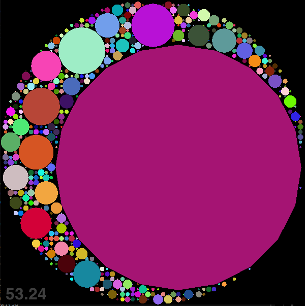
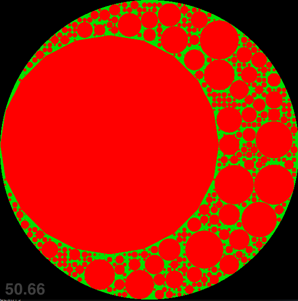

[xScreenSaver circles but random](https://www.youtube.com/watch?v=aeWnjSROR8U)   
Apollonian      
A fractal packing of circles with smaller circles, demonstrating Descartes's theorem.       

Wikipedia: "Apollonian gasket"     
Wikipedia: "Descartes' theorem"           
     

  
- [x] pause/resume(R)      
- [x] frame by frame(S)    
- [x] random circles    
- [x] quite(Q)    
